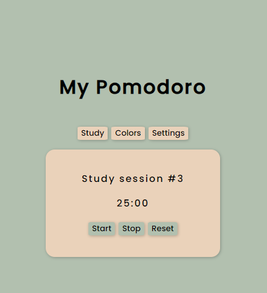
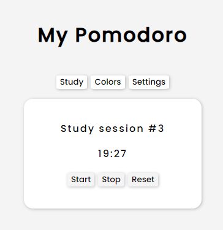
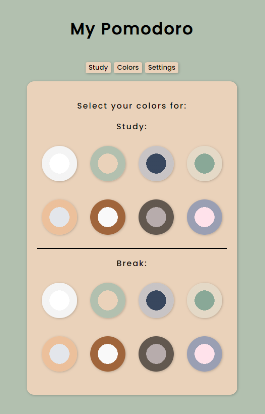

# My Pomodoro!
This is my first web app that I created because I wanted to use the pomodoro method to study.

I created a working timer that will change to the break section when it runs out.

Below is the color palette that I created, with buttons that can change the theme of your pomodoro.

You can have separate colors for when you are studying or taking a break.

Something I have yet to add is the settings section. This section will be able to change the parameters for the length of the study and break.

Another thing I want to do is create this app using React.

# Function Specifications
The functions are pretty simple, so I'm writing this to for the experience.
